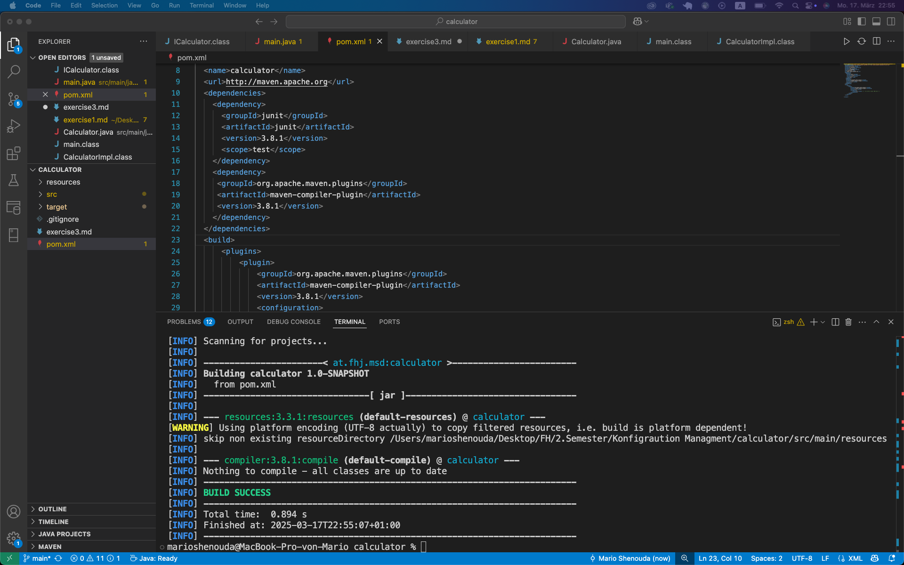
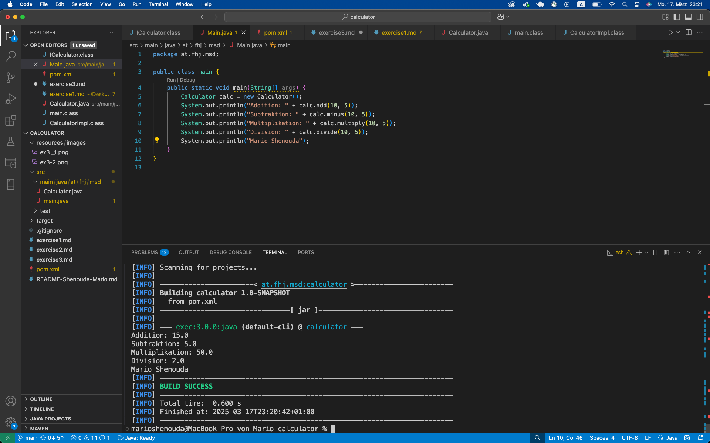

# Exercise 3

## beschreiben über maven projekt

Nach der ersten Kompilierung wurde der Ordner `target/` automatisch erstellt.
Er enthält die kompilierten `.class`-Dateien und das Maven-Build-Resultat.

## Erfolgreiche Ausführung mit `mvn exec:java`

Nach dem Starten des Programms mit `mvn exec:java` wurde mein Name erfolgreich ausgegeben:

## Erfolgreiche Ausführung mit `mvn exec:java` und name

Erfolgreiche Ausführung mit `mvn exec:java`
Nach dem Starten des Programms mit `mvn exec:java` wurde mein Name erfolgreich ausgegeben:
