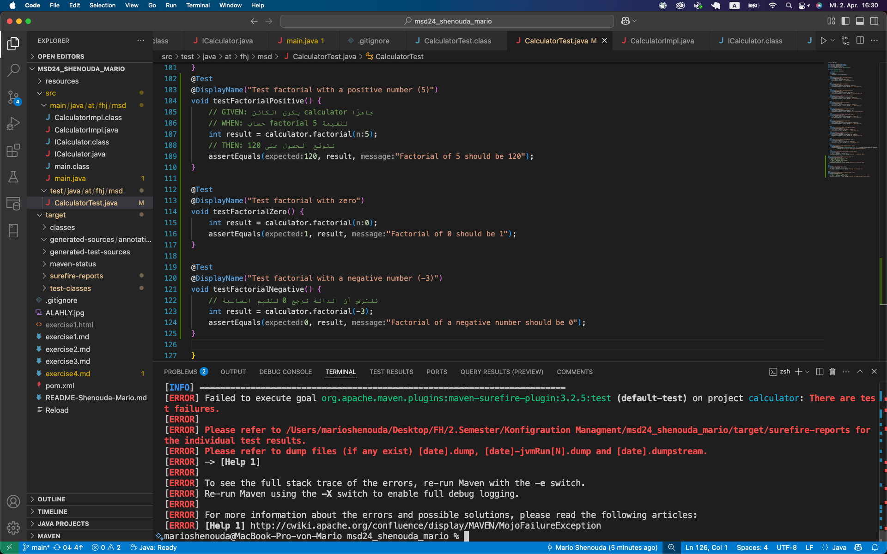
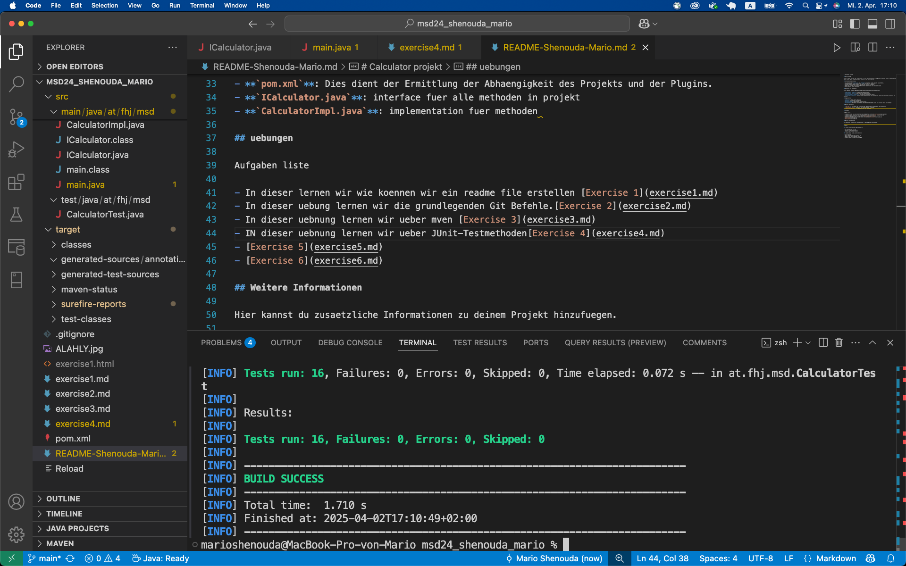

# Exercise 4

## Beschreiben ueber JUnit-Testmethoden

In diesem Dokument werden die Testfaelle beschrieben, die zur ueberpruefung der `factorial()`-Methode im Taschenrechnerprojekt verwendet werden. Die Testfaelle wurden im Rahmen eines Test-Driven Development (TDD)-Ansatzes erstellt, bei dem zunaechst fehlschlagende Tests (Red-Phase) implementiert wurden, um die Anforderungen zu definieren. Anschliessend erfolgte die Implementierung der Methode (Green-Phase) und deren Optimierung (Refactor-Phase).

## Testfaelle

### 1. Fakultaet für positive Zahlen

- **Beschreibung:**  
  Die Methode `factorial()` soll bei Eingabe einer positiven Zahl, z.B. 5, das korrekte Ergebnis (120) zurueckgeben, da 5! = 120.

### 2. Fakultaet fuer den wert 0

- **Bescheibung:**
Nach der mathematischen Definition gilt: 0! = 1.

### 3. Fakultaet für negative Zahlen

- **Beschreibung:**
Da die Fakultaet für negative Zahlen nicht definiert ist, soll die Methode factorial() in diesem Fall den Wert 0 zurueckgeben.

## TDD-Prozess und Versionierung

### Red-Phase

- **Beschreibung**

Zunaechst wurden die oben genannten Tests implementiert, die erwartungsgemaess fehlschlagen, da die factorial()-Methode noch nicht korrekt implementiert war.

 Ein Screenshot der fehlschlagenden Tests (Red-Phase) wurde als ex4_2.png im Ordner resources/images gespeichert.

### Green-Phase

 Anschliessend wurde die factorial()-Methode implementiert, sodass alle Tests erfolgreich durchlaufen.

### Refactor-Phase

Nachdem alle Tests bestanden wurden, wurde der Code optimiert (Refactoring), ohne die Funktionalitaet zu veraendern.

Screenshot der Testabdeckung nach erfolgreichem Testlauf

